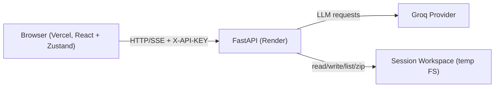

# Charito: Full-System Technical Documentation (Recreation-Grade)

Last verified against commit: `1999c71dbb23bf82039e2c328b1995eb7f221bef`

Document intent: this file is an implementation-level specification for reproducing the current system behavior and contracts without reverse engineering the repository.

## Table of Contents
- [1. System Overview](#1-system-overview)
- [2. System Boundaries and Trust Model](#2-system-boundaries-and-trust-model)
- [3. End-to-End Runtime Flow](#3-end-to-end-runtime-flow)
- [4. Backend Architecture](#4-backend-architecture)
- [5. API Contract Reference](#5-api-contract-reference)
- [6. Stream (SSE) Protocol Specification](#6-stream-sse-protocol-specification)
- [7. Frontend Architecture and State Contracts](#7-frontend-architecture-and-state-contracts)
- [8. Prompt Composition and Override Semantics](#8-prompt-composition-and-override-semantics)
- [9. Workspace Filesystem Semantics](#9-workspace-filesystem-semantics)
- [10. Security and Configuration Model](#10-security-and-configuration-model)
- [11. Deployment Architecture (Vercel + Render)](#11-deployment-architecture-vercel--render)
- [12. Local Development and Reproducibility Runbook](#12-local-development-and-reproducibility-runbook)
- [13. Testing and Verification Matrix](#13-testing-and-verification-matrix)
- [14. Failure Modes and Troubleshooting](#14-failure-modes-and-troubleshooting)
- [15. Known Limitations and Extension Points](#15-known-limitations-and-extension-points)
- [16. Appendices](#16-appendices)
- [17. Documentation Currency Policy](#17-documentation-currency-policy)

## 1. System Overview
### Purpose
Charito is an agentic coding platform that converts a user prompt into a generated project by executing a strict three-node workflow:

1. `planner` -> produce structured `Plan`
2. `architect` -> produce structured `TaskPlan`
3. `coder` -> execute file-level tasks iteratively until `status == DONE`

### Source of Truth
- `agent/graph.py`
- `agent/state.py`
- `agent/api.py`
- `frontend/src/app/store/useAgentStore.ts`

### Behavior
- The backend exposes synchronous (`/generate`) and streaming (`/stream`) workflow APIs.
- The frontend Live Studio consumes normalized stream events and maintains workflow graph status, logs, and workspace state in Zustand.
- Project files are created/edited in a session-scoped temp workspace and can be downloaded as ZIP.

### Inputs/Outputs
- Input: user prompt + provider API key + optional prompt overrides.
- Output: generated file tree and file contents in workspace; optional final `Plan` and `TaskPlan` in `/generate`.

### Failure Modes
- Provider connection/auth/rate-limit/context issues.
- Missing/misconfigured API base URL in frontend deployment.
- CORS or workspace-auth misconfiguration in production.

### Examples
- User prompt: "Build a minimal FastAPI health check endpoint."
- Typical output: `Plan`, `TaskPlan`, files like `main.py`, `requirements.txt`, `README.md`.

## 2. System Boundaries and Trust Model
### Purpose
Define what this system does and where trust boundaries exist.

### Source of Truth
- `agent/api.py`
- `agent/security_config.py`
- `agent/workspace.py`
- `frontend/src/app/lib/api-key-storage.ts`

### Behavior
In-scope:
- FastAPI runtime + LangGraph orchestration.
- Prompt policy and composition.
- Workspace CRUD and ZIP export.
- SSE normalization and frontend state sync.
- Vercel frontend + Render backend deployment model.

Out-of-scope:
- Persistent database/state store.
- User identity provider (JWT/OAuth/session identity).
- Multi-tenant authorization model beyond API-key presence gate for workspace APIs.

Trust boundaries:
- Browser to backend: cross-origin HTTP/SSE.
- Backend to provider (Groq): outbound LLM API calls.
- Backend to local filesystem: workspace temp directories.

### Inputs/Outputs
- Browser sends `X-API-KEY` and optionally `X-Workspace-ID`.
- Backend never persists API keys in workspace APIs.

### Failure Modes
- Trust boundary misconfiguration (CORS or env mismatch) manifests as frontend "Network Error."

### Examples


## 3. End-to-End Runtime Flow
### Purpose
Describe precise lifecycle from prompt submission to generated files.

### Source of Truth
- `agent/api.py`
- `agent/graph.py`
- `frontend/src/app/store/useAgentStore.ts`
- `frontend/src/app/pages/LiveStudio.tsx`

### Behavior
1. Frontend initializes workspace session (`POST /workspace/session`) on Studio load.
2. User provides API key (session-first storage), enters prompt, triggers run.
3. Live Studio resolves run mode before streaming:
   - first-pass (no workspace artifacts): starts directly in `workspaceMode="continue"` without confirmation.
   - later runs (workspace has files): opens chooser modal (`Continue Current Workspace` vs `Start Fresh Workspace`).
4. Frontend calls `POST /stream` with `RunWorkflowRequest`.
5. Backend validates payload, resolves key + workspace, builds chat model, starts graph stream.
6. Backend normalizes LangGraph stream into SSE events.
7. Frontend store ingests events, updates graph/log state, and on completion syncs files/tree.
8. Prompt edits after a submitted run reset run visualization (`resetRunVisualization(true)`) when not actively generating.
9. Reset Session during generation aborts active stream first, appends stop-info log, then rotates workspace session.
10. User inspects/edits files; can download ZIP.

### Inputs/Outputs
- Input payload: `user_prompt`, optional `model`, `recursion_limit`, `mutable_prompt`, `prompt_overrides`, `workspace_id`, `api_key`.
- Output stream: lifecycle + node + progress + error events with normalized envelope fields.

### Failure Modes
- Pre-stream errors return normal JSON API errors.
- Mid-stream errors emit SSE `error` event with classified `error_type` and `hint`.
- User-triggered Reset Session aborts the active stream without classifying as runtime failure.

### Examples
```text
run_started
on_node_start(planner)
on_node_end(planner)
on_node_start(architect)
on_node_end(architect)
on_node_start(coder) x N
on_node_end(coder) x N
run_complete
```

## 4. Backend Architecture
## 4.1 `agent/state.py`
### Purpose
Define typed contracts for planner, architect, coder graph state.

### Source of Truth
- `agent/state.py`

### Behavior
- `Plan`: app name, description, techstack, features, files (`FileSpec` list).
- `TaskPlan`: ordered `implementation_steps` (one per file).
- `CoderState`: tracks `task_plan`, `current_step_idx`, optional `current_file_content`.
- `AgentState`: graph state typed dict carrying messages + prompt fields + outputs.

### Inputs/Outputs
- Used by LangGraph `StateGraph(AgentState)` and structured-output calls.

### Failure Modes
- Invalid structured outputs raise validation errors upstream.

### Examples
```python
class ImplementationStep(BaseModel):
    file_path: str
    task_description: str
```

## 4.2 `agent/llm_factory.py`
### Purpose
Build provider model instances.

### Source of Truth
- `agent/llm_factory.py`

### Behavior
- Provider is `groq`.
- Default model constant: `openai/gpt-oss-120b`.
- `build_chat_model(api_key, model)` validates key non-empty and returns `ChatGroq`.

### Inputs/Outputs
- Input: raw API key and optional model override.
- Output: `BaseChatModel`.

### Failure Modes
- Empty API key -> `ValueError("api_key is required.")`.

## 4.3 `agent/prompts.py` + `config/prompts.py`
### Purpose
Compose guarded prompts from immutable policy + node prefix + mutable layer + context.

### Source of Truth
- `agent/prompts.py`
- `config/prompts.py`

### Behavior
- `MAX_MUTABLE_PROMPT_CHARS = 4000`.
- Node configs exist for `planner`, `architect`, `coder`.
- Composition order is strict:
1. Global immutable rules
2. Node immutable prefix
3. Mutable layer
4. Runtime context block

Mutable resolution precedence:
1. `prompt_overrides[node_id]` when present and non-empty
2. Legacy `mutable_prompt` when non-empty
3. Node `default_mutable`

### Inputs/Outputs
- Input: node id, overrides, legacy mutable prompt, runtime context.
- Output: composed prompt string.

### Failure Modes
- Unknown override node key.
- Mutable payload length > 4000.

### Examples
```python
get_composed_prompt("planner", user_content, f"User Request:\n{user_prompt}")
```

## 4.4 `agent/tools.py`
### Purpose
Expose coding tools used by the `coder` agent.

### Source of Truth
- `agent/tools.py`

### Behavior
- `write_file(path, content)` writes text file in workspace.
- `read_file(path)` reads text file; returns error string on missing/binary.
- `list_files(directory=".")` returns newline-separated relative paths.

### Inputs/Outputs
- Inputs are tool-call arguments from agent runtime.
- Outputs are strings (tool protocol).

### Failure Modes
- Invalid paths/directories return user-visible `ERROR: ...` strings.

## 4.5 `agent/workspace.py`
### Purpose
Provide session-scoped workspace filesystem with safety guarantees.

### Source of Truth
- `agent/workspace.py`

### Behavior
- Workspaces are under OS temp dir: `tempfile.gettempdir()/intern-mini-workspaces`.
- Session TTL default: `3600s`.
- Workspace IDs are regex-validated: `[A-Za-z0-9_-]{1,128}`.
- All path operations enforce workspace-root containment.
- Max editable content length: `400_000` chars.
- ZIP export includes all files relative to workspace root.

### Inputs/Outputs
- Inputs: workspace id, relative path, file content.
- Outputs: normalized relative paths, file maps, tree nodes, zip bytes.

### Failure Modes
- Traversal or invalid path -> `WorkspaceValidationError`.
- Binary text read -> `WorkspaceBinaryFileError`.
- Conflicts (rename/delete) -> `WorkspaceConflictError`.

### Examples
```python
resolve_workspace_path("../escape.py")  # raises WorkspaceValidationError
```

## 4.6 `agent/graph.py`
### Purpose
Define and execute workflow graph.

### Source of Truth
- `agent/graph.py`

### Behavior
- Graph nodes: `planner`, `architect`, `coder`.
- Edges:
  - `planner -> architect`
  - `architect -> coder`
  - conditional `coder -> coder` until `status == "DONE"`
- Planner and architect use structured output (`Plan`, `TaskPlan`).
- Coder executes one step per iteration and increments `current_step_idx`.
- Coder tools: `read_file`, `write_file`, `_list_workspace_files`.

### Inputs/Outputs
- Input state: prompt + prompt layers.
- Output state: plan + detailed instructions + coder state + status.

### Failure Modes
- Missing prompt.
- LLM structured output errors.
- Tool-side workspace errors.

### Examples
```python
graph.add_conditional_edges(
  "coder",
  lambda state: "END" if state.get("status") == "DONE" else "coder",
  {"END": END, "coder": "coder"},
)
```

## 4.7 `agent/security_config.py`
### Purpose
Parse and enforce env-driven runtime security defaults.

### Source of Truth
- `agent/security_config.py`

### Behavior
- `APP_ENV` controls production/development defaults.
- In production defaults:
  - `cors_allowed_origins=[]` unless configured.
  - `require_workspace_auth=True`.
  - `expose_verbose_errors=False`.
- If wildcard origin + credentials -> credentials forced false.

### Inputs/Outputs
- Input: process env vars.
- Output: `SecurityConfig` dataclass.

### Failure Modes
- Missing production CORS origin leads to browser failures despite healthy backend.

## 4.8 `agent/api.py`
### Purpose
Expose external API contracts and stream normalization layer.

### Source of Truth
- `agent/api.py`

### Behavior
- Adds CORS middleware using loaded security config.
- Defines endpoint models and error envelopes.
- Implements workspace auth dependency for workspace endpoints.
- Implements `/generate` and `/stream`.
- `/stream` normalizes raw LangGraph tuple modes (`debug`, `messages`, `updates`) into stable event envelopes.

### Inputs/Outputs
- Input: JSON request bodies + headers.
- Output: JSON envelopes or text/event-stream.

### Failure Modes
- Validation -> 422.
- Workspace auth required -> 401.
- Runtime unhandled -> 500 (`internal_error`).

## 5. API Contract Reference
All responses use JSON unless explicitly noted.

## 5.1 Health and schema endpoints
### `GET /health`
- Auth: none
- Returns:
  - `status`
  - `provider`
  - `default_model`
  - `max_mutable_prompt_chars`
  - `max_editable_file_chars`
  - `workspace_auth_required`
  - `app_env`

### `GET /v1/prompt-policy`
- Returns immutable prompt policy.

### `GET /api/prompts`
### `GET /prompts/schema`
### `GET /v1/prompts/schema`
- Same payload:
  - `nodes` with `immutable_prefix` and `default_mutable` for each node
  - `policy` with immutable rules + max mutable chars

### `GET /graph/schema`
- React-flow compatible static graph schema with three nodes and coder loop edge.

## 5.2 Workspace APIs
Workspace endpoints can require `X-API-KEY` depending on env (`REQUIRE_WORKSPACE_AUTH`).

Headers:
- `X-API-KEY`: required when workspace auth enabled.
- `X-Workspace-ID`: optional; used for session resolution.

Resolution order for workspace id in API:
1. request body workspace id (where supported)
2. query workspace id
3. `X-Workspace-ID` header
4. default workspace

### Session
- `POST /workspace/session` -> create session
- `POST /workspace/session/{workspace_id}/touch` -> refresh expiry
- `DELETE /workspace/session/{workspace_id}` -> delete session root

### Filesystem operations
- `GET /workspace/tree`
- `GET /workspace/files`
- `GET /workspace/file?path=...`
- `PUT /workspace/file` with `{path, content, workspace_id?}`
- `POST /workspace/folder` with `{path, workspace_id?}`
- `POST /workspace/rename` with `{from_path, to_path, overwrite, workspace_id?}`
- `DELETE /workspace/path?path=...&recursive=...`
- `GET /workspace/download` (returns `application/zip`)

## 5.3 Workflow APIs
### Request envelope: `RunWorkflowRequest`
```json
{
  "user_prompt": "string, required",
  "api_key": "string, optional if X-API-KEY header set",
  "mutable_prompt": "string | null",
  "prompt_overrides": {"planner":"...", "architect":"...", "coder":"..."},
  "workspace_id": "string | null",
  "model": "string | null",
  "recursion_limit": 100
}
```

### `POST /generate` and `POST /v1/workflows/run`
Success response: `RunWorkflowResponse`
```json
{
  "status": "DONE",
  "provider": "groq",
  "workspace_id": "workspace_id",
  "plan": {...},
  "task_plan": {...}
}
```

### `POST /stream` and `POST /v1/workflows/stream`
- Content-Type: `text/event-stream`
- Emits normalized event stream (see Section 6).

## 5.4 Error envelope
```json
{
  "error": {
    "code": "invalid_request|workspace_unauthorized|workspace_conflict|workflow_error|...",
    "message": "human readable",
    "details": {}
  }
}
```

HTTP status mappings:
- `422`: validation / invalid request / workspace validation / binary file error
- `401`: workspace auth required
- `404`: workspace file/path not found
- `409`: workspace conflict
- `500`: workflow/internal/workspace runtime errors

## 6. Stream (SSE) Protocol Specification
### Purpose
Define transport and semantic contracts for Live Studio real-time state.

### Source of Truth
- `agent/api.py` (`_normalize_langgraph_stream_item`, `stream_agent_workflow`)
- `frontend/src/app/lib/sse.ts`
- `frontend/src/app/store/useAgentStore.ts`

### Behavior
Transport block format:
```text
event: <event_name>
data: <json>

```

Event lifecycle (typical success):
1. `run_started`
2. `on_node_start`/`on_node_end` pairs across nodes
3. `run_complete`

Failure:
1. `run_started`
2. zero or more node events
3. `error`
4. User-triggered client abort (`Reset Session`) may end stream consumption without a terminal SSE `error` row in UI; store treats this as expected control flow.

### Shared payload fields
Most emitted events include:
- `run_id`
- `workspace_id`
- `event_id` (monotonic increasing per stream)
- `timestamp` (ISO-8601)
- `node`
- `state`
- `activity_score`
- `phase`
- `severity`
- `message`
- `details`
- `hint`
- `error_type`
- `iteration`
- `duration_ms`
- `namespace`
- `raw`
- `active_node_id`
- `node_states` (workflow nodes map)
- `activity_by_node_id` (workflow nodes map)

### Event-specific semantics
- `run_started`: system start metadata.
- `on_node_start`: node became active, includes iteration metadata.
- `on_chat_model_stream`: token stream chunks (debug-level).
- `on_node_end`: node update completion + summarized details.
- `on_debug_event`: non-primary diagnostic events.
- `run_complete`: terminal success.
- `error`: terminal failure with classification.

### Runtime synthesis rules
- Node state/activity maps are maintained centrally and attached to every emitted event.
- Active node updates on `on_node_start` and clears on matching `on_node_end`.
- After workflow iteration ends, any lingering active workflow nodes are finalized to completed via synthetic `on_node_end`.
- Frontend run ingestion is guarded by run token to drop stale events from an older/aborted run.

### Error classification contract
Backend classifies exceptions into:
- `rate_limit`
- `auth_error`
- `connection_error`
- `context_limit`
- `invalid_request`
- `unknown_error`

Each includes an actionable `hint`.
Client-side abort semantics:
- Abort reason `session_reset` suppresses classified error-noise in operator logs.
- Non-abort failures still surface classified `error_type` + `hint`.

### Canonical successful stream transcript (abridged)
```text
event: run_started
data: {"event_id":1,"message":"Workflow run started ...","node_states":{"planner":"idle","architect":"idle","coder":"idle"}}

event: on_node_start
data: {"event_id":2,"node":"planner","state":"active","iteration":1}

event: on_node_end
data: {"event_id":3,"node":"planner","state":"completed","details":{"planned_files":4}}

event: on_node_start
data: {"event_id":4,"node":"architect","state":"active","iteration":1}

event: on_node_end
data: {"event_id":5,"node":"architect","state":"completed","details":{"total_steps":4}}

event: on_node_start
data: {"event_id":6,"node":"coder","state":"active","iteration":1}

event: on_node_end
data: {"event_id":7,"node":"coder","state":"completed","details":{"current_step_idx":1,"total_steps":4,"text":"file 2/4 (1 completed)"}}

event: run_complete
data: {"event_id":999,"message":"Workflow finished successfully.","status":"DONE"}
```

### Canonical failure stream transcript (abridged)
```text
event: run_started
data: {"event_id":1,...}

event: error
data: {
  "event_id":2,
  "state":"error",
  "error_type":"connection_error",
  "hint":"Network connection to provider failed. Verify proxy/network settings and try again.",
  "message":"Workflow failed during streaming."
}
```

## 7. Frontend Architecture and State Contracts
## 7.1 Routing and shell
### Source of Truth
- `frontend/src/app/routes.tsx`
- `frontend/src/app/components/Layout.tsx`

Routes:
- `/` landing
- `/docs`
- `/about`
- `/studio`

SPA routing requires fallback to `index.html` in production (see `frontend/vercel.json`).

## 7.2 API client contract
### Source of Truth
- `frontend/src/app/lib/api-client.ts`

Behavior:
- `API_BASE_URL` resolution:
  - `VITE_API_BASE_URL` if defined.
  - fallback to `http://localhost:8000` only in local/non-prod runtime.
  - in production without configured base URL, requests fail with explicit configuration error.
- Axios request interceptor injects:
  - `X-API-KEY` from storage
  - `X-Workspace-ID` from store context

## 7.3 API key storage model
### Source of Truth
- `frontend/src/app/lib/api-key-storage.ts`

Behavior:
- Session-first retrieval.
- Optional remember mode persists in `localStorage`.
- Legacy keys (`groq_api_key`, `api_key`) are still read and cleaned.

## 7.4 Global store (`useAgentStore`)
### Source of Truth
- `frontend/src/app/store/useAgentStore.ts`

State responsibilities:
- Workspace: session id, expiry, file map, tree nodes.
- Graph: active node, node status map, activity map.
- Logs: summary-first, filtered from noisy internal events.
- Prompt overrides, schema policy, runtime errors.

Behavior highlights:
- Graph state only tracks workflow nodes `planner|architect|coder`.
- Non-workflow runtime nodes do not mutate workflow graph.
- `resetRunVisualization(clearLogs?: boolean)` resets graph status/activity/active-node and optionally clears logs.
- `startAgentRun` accepts frontend run mode intent (`workspaceMode: "fresh" | "continue"`), resolves workspace session accordingly, and handles pre-stream/stream errors with classifier.
- `startAgentRun` uses `AbortController` + run token guard to support cancellation and stale-event suppression.
- `resetWorkspaceSession` aborts active generation (if running), appends `Generation stopped by session reset.` info log, then rotates workspace session.
- `syncSseEvent` builds UI-ready logs from raw SSE, preserving raw payload in details for diagnostics.

## 7.5 Live Studio runtime behavior
### Source of Truth
- `frontend/src/app/pages/LiveStudio.tsx`

Core runtime sequence:
1. On mount:
  - init workspace session
  - fetch files, tree, graph schema, prompt schema
2. On Run click:
  - if workspace has no artifacts, start immediately (`continue` mode).
  - if workspace has artifacts/files, show workspace rollover modal (`continue` vs `fresh`).
3. While run active:
  - poll tree every 1200ms for live file visibility
4. On run complete:
  - sync files + tree once more
5. On prompt draft divergence from last submitted prompt (while not running):
  - clear graph + logs via `resetRunVisualization(true)`.

Graph semantics:
- Planner/Architect/Coder status badges: `idle|running|done|error`.
- Active node summary:
  - non-coder: iteration-based
  - coder: file-progress based (`working on file X/Y`)

Coder progress derivation:
- Parse log details for `total_steps` and `current_step_idx`.
- Compute `completedFiles` and active file index.

Prompt tab semantics:
- Single combined textarea with locked header + editable suffix.
- Locked sections include immutable policy and immutable node prefix.
- Only editable suffix is sent as `prompt_overrides`.

Logs viewport semantics:
- Auto-follow is conditional, not forced.
- Log panel scrolls to bottom only when user is already near bottom (threshold ~48px).
- If user scrolls up, incoming logs do not force-scroll the viewport.

## 8. Prompt Composition and Override Semantics
### Purpose
Guarantee predictable prompt layering and user override behavior.

### Source of Truth
- `agent/prompts.py`
- `config/prompts.py`
- `frontend/src/app/store/prompt-editor.ts`

### Behavior
Server composition:
1. Global immutable rules (highest priority)
2. Node immutable prefix
3. Mutable layer (override or legacy or default)
4. Context block

UI editing model:
- Display full composed "system prompt editor" surface with locked and editable regions.
- Enforce immutability by rejecting edits that alter required locked prefix.

### Inputs/Outputs
- Input: node choice + editable suffix.
- Output: `prompt_overrides[node] = editableSuffix`.

### Failure Modes
- Oversized mutable text rejected at API validation.
- Unknown override key rejected with 422.

## 9. Workspace Filesystem Semantics
### Purpose
Specify exact filesystem lifecycle and guarantees.

### Source of Truth
- `agent/workspace.py`
- workspace endpoints in `agent/api.py`

### Behavior
- Session scope: each workspace id maps to dedicated temp directory.
- Expiry: sessions have TTL and are touch-refreshed.
- Safety:
  - relative paths only
  - no absolute paths, no drive-qualified paths
  - no traversal outside root
- Text-only editing:
  - UTF-8 read/write
  - binary files skipped in flat listing
- ZIP export:
  - deterministic relative paths from root

### Inputs/Outputs
- `list_tree` returns nested node objects.
- `list_flat_text_files` returns map `{path: content}` + `skipped_binary`.

### Failure Modes
- Non-empty directory delete without `recursive=true` -> conflict (409).
- Renaming to existing path without overwrite -> conflict.

## 10. Security and Configuration Model
### Purpose
Define secure-by-env behavior and runtime controls.

### Source of Truth
- `agent/security_config.py`
- CORS/auth setup in `agent/api.py`
- frontend API base URL handling in `frontend/src/app/lib/api-client.ts`

### Behavior
Backend env variables:
- `APP_ENV`: `development|production`
- `CORS_ALLOWED_ORIGINS`: CSV allowlist
- `CORS_ALLOW_CREDENTIALS`: bool
- `REQUIRE_WORKSPACE_AUTH`: bool
- `EXPOSE_VERBOSE_ERRORS`: bool

Security behaviors:
- Workspace auth dependency enforces non-empty `X-API-KEY` when enabled.
- Production defaults to no verbose server error chains.
- CORS in production must be explicit-origin configured.

Frontend env variable:
- `VITE_API_BASE_URL` must point to backend URL in deployed environments.

### Failure Modes
- Backend healthy but frontend calls fail due CORS or missing `VITE_API_BASE_URL`.

## 11. Deployment Architecture (Vercel + Render)
### Source of Truth
- `render.yaml`
- `frontend/vercel.json`

### Backend (Render)
- Service type: web (python, free tier)
- Build: `pip install -r requirements.txt`
- Start: `uvicorn agent.api:app --host 0.0.0.0 --port $PORT`
- Health: `/health`

Recommended production env values:
- `APP_ENV=production`
- `CORS_ALLOW_CREDENTIALS=false`
- `REQUIRE_WORKSPACE_AUTH=true`
- `EXPOSE_VERBOSE_ERRORS=false`
- `CORS_ALLOWED_ORIGINS=https://<vercel-domain>`

### Frontend (Vercel)
- Root directory: `frontend`
- Build command: `npm run build`
- Output directory: `dist`
- SPA fallback route rewrite to `/index.html`
- Required env: `VITE_API_BASE_URL=https://<render-backend-domain>`

### Cross-origin wiring checklist
1. Deploy backend first, obtain URL.
2. Set frontend `VITE_API_BASE_URL`.
3. Deploy frontend, obtain URL.
4. Set backend `CORS_ALLOWED_ORIGINS` to exact frontend origin(s).
5. Redeploy backend.

## 12. Local Development and Reproducibility Runbook
### Prerequisites
- Python environment with `requirements.txt`.
- Node/npm for frontend.

### Backend setup
```bash
python -m venv venv
venv\Scripts\activate
pip install -r requirements.txt
uvicorn agent.api:app --host 0.0.0.0 --port 8000 --reload
```

### Frontend setup
```bash
cd frontend
npm install
npm run dev
```

### Environment setup
- Backend can consume API key from request body/header, so server-side provider key is not strictly required for this workflow mode.
- Frontend local default API URL is `http://localhost:8000` when `VITE_API_BASE_URL` is absent in non-prod.

### Local smoke test sequence
1. `GET http://localhost:8000/health`
2. `GET /api/prompts`
3. `POST /workspace/session` with `X-API-KEY` if workspace auth enabled
4. `POST /stream` with small prompt + API key
5. Verify files appear in Studio tree and are downloadable as ZIP

### Minimal stream curl example
```bash
curl -N -X POST http://localhost:8000/stream \
  -H "Content-Type: application/json" \
  -H "X-API-KEY: gsk_your_key" \
  -d "{\"user_prompt\":\"Build a tiny FastAPI health endpoint\"}"
```

## 13. Testing and Verification Matrix
### Purpose
Map automated tests to runtime contracts and behavior guarantees.

### Source of Truth
- `tests/*.py`
- `frontend/src/**/*.test.ts`

### Backend test coverage
- `test_generate_validation.py`
  - payload validation, API key fallback, `/generate` error classification, verbose leak guard
- `test_stream_langgraph_streaming.py`
  - stream modes, lifecycle ordering, event monotonic ids, error classification/visibility
- `test_workspace_api.py`
  - workspace CRUD endpoints, traversal rejection, auth gate behavior
- `test_workspace_service.py`
  - core filesystem service semantics
- `test_graph_prompt_overrides.py`
  - override precedence
- `test_prompt_schema_api.py`
  - schema endpoint parity
- `test_prompts_composition.py`
  - prompt ordering + size constraints
- `test_graph_schema_api.py`
  - graph schema shape and models

### Frontend test coverage
- `api-key-storage.test.ts`
  - storage precedence and remember semantics
- `sse.test.ts`
  - SSE block parsing and stream consumption
- `prompt-editor.test.ts`
  - locked-prefix/suffix editing semantics
- `useAgentStore.test.ts`
  - workflow state transitions, log filtering, run path, error propagation
  - run-mode workspace semantics (`fresh` vs `continue`)
  - visualization reset behavior (`resetRunVisualization`)
  - reset-session abort path and stop-log behavior

### Suggested CI commands
```bash
python -m pytest -q tests
cd frontend && npm run test
cd frontend && npm run build
```

## 14. Failure Modes and Troubleshooting
## 14.1 Frontend shows `Network Error` on workspace/session
Likely causes:
- `VITE_API_BASE_URL` missing or wrong in deployed frontend
- backend CORS origin not matching frontend origin
- HTTPS/mixed-content mismatch

Checks:
1. Browser devtools request URL is backend URL, not localhost.
2. `GET /health` from browser origin works cross-origin.
3. CORS headers include exact frontend origin.

## 14.2 `/stream` returns/ends with `connection_error`
Cause:
- provider path/network unreachable

Expected behavior:
- classified `error_type=connection_error`
- actionable `hint` emitted to frontend logs/errors

## 14.3 Workspace auth failures
Symptoms:
- 401 `workspace_unauthorized`
- Studio message requiring API key

Fix:
- provide non-empty API key in UI (stored and sent as `X-API-KEY`)
- or relax `REQUIRE_WORKSPACE_AUTH` for local dev

## 14.4 Missing production API base URL
Frontend behavior:
- explicit configuration error (`API base URL is not configured ...`)

Fix:
- set `VITE_API_BASE_URL` in deployment environment.

## 14.5 Reset Session while a run is active
Expected behavior:
- Active stream is aborted immediately.
- Graph status returns to idle via visualization reset.
- A non-error info log appears: `Generation stopped by session reset.`
- Workspace session is rotated and file/tree state is cleared for the new session.

If this does not happen:
1. Verify `isGenerating` was true when reset clicked.
2. Verify frontend store has active abort wiring (`AbortController`, `session_reset` reason).
3. Verify no stale stream events are overriding state after abort (run token guard).

## 14.6 Log panel jumps while reading older logs
Expected behavior:
- Auto-follow only when user is near bottom.
- No forced scroll jump when user is scrolled up.

If jumping persists:
1. Confirm conditional auto-follow logic is active (near-bottom threshold ~48px).
2. Ensure no remaining `scrollIntoView` on every `logs` update.

## 15. Known Limitations and Extension Points
### Current limitations
1. Provider dependency and internet availability directly impact run success.
2. No persistent project database; workspaces are temp-session based.
3. No identity auth system beyond API-key presence gate for workspace APIs.
4. Frontend production bundle currently emits chunk-size warning.
5. Coder toolset is intentionally narrow (read/list/write only).

### High-value extension points
1. Provider abstraction for multi-provider fallback/retry.
2. Auth hardening with first-class identity + per-workspace authorization.
3. Persistent workspace storage (object store / DB metadata layer).
4. Structured observability pipeline (metrics, traces, run registry).
5. Deterministic run replay snapshots for debugging/regression testing.

## 16. Appendices
## 16.1 Full endpoint index
- `GET /health`
- `GET /v1/prompt-policy`
- `GET /api/prompts`
- `GET /prompts/schema`
- `GET /v1/prompts/schema`
- `GET /graph/schema`
- `POST /workspace/session`
- `POST /workspace/session/{workspace_id}/touch`
- `DELETE /workspace/session/{workspace_id}`
- `GET /workspace/tree`
- `GET /workspace/files`
- `GET /workspace/file`
- `PUT /workspace/file`
- `POST /workspace/folder`
- `POST /workspace/rename`
- `DELETE /workspace/path`
- `GET /workspace/download`
- `POST /generate`
- `POST /v1/workflows/run`
- `POST /stream`
- `POST /v1/workflows/stream`

## 16.2 Stream/event glossary
- `run_id`: unique workflow run identifier.
- `event_id`: monotonically increasing integer per stream.
- `node_states`: workflow node state map.
- `activity_by_node_id`: workflow node activity score map.
- `raw`: preserved raw normalized source payload.

## 16.3 Frontend store field glossary
- `workspaceId`: active workspace session id.
- `workspaceExpiresAt`: ISO expiry from backend session.
- `files`: flat text file map.
- `treeNodes`: hierarchical file tree.
- `activeNodeId`: currently active workflow node.
- `nodeStatusById`: workflow status map (`idle|active|completed|error`).
- `activityByNodeId`: numeric activity model values.
- `logs`: filtered operator-facing event log list.
- `promptOverrides`: per-node mutable suffix values.

## 16.4 Configuration quick reference
Backend:
- `APP_ENV`
- `CORS_ALLOWED_ORIGINS`
- `CORS_ALLOW_CREDENTIALS`
- `REQUIRE_WORKSPACE_AUTH`
- `EXPOSE_VERBOSE_ERRORS`

Frontend:
- `VITE_API_BASE_URL`

## 16.5 File/module ownership index
- `agent/api.py`: API contracts + stream normalization.
- `agent/graph.py`: workflow orchestration.
- `agent/prompts.py`: prompt composition.
- `config/prompts.py`: immutable policy + node defaults.
- `agent/workspace.py`: workspace filesystem service.
- `agent/security_config.py`: env-driven security defaults.
- `frontend/src/app/lib/api-client.ts`: transport contract client.
- `frontend/src/app/store/useAgentStore.ts`: state orchestration and SSE ingestion.
- `frontend/src/app/pages/LiveStudio.tsx`: operator UI and interaction layer.
- `tests/`: backend contract and behavior verification.
- `frontend/src/**/*.test.ts`: frontend contract/state verification.

## 17. Documentation Currency Policy
Purpose:
- Keep this master document synchronized with runtime behavior and contracts on every behavior-changing PR.

Policy:
1. If a PR changes runtime behavior, API contracts, SSE payload semantics, workspace lifecycle, prompt policy, or deployment wiring, update this file in the same PR.
2. Update `Last verified against commit` to the PR branch head commit after doc edits.
3. In PR description, reference which sections were updated (for reviewer traceability).
4. Do not defer documentation updates to follow-up PRs for contract/runtime changes.

Required review check:
- Reviewer confirms docs are updated or explicitly confirms “no behavior/contract change”.

---

This document is intended to be executable as a reconstruction guide. If behavior diverges after future commits, regenerate this document against the new commit and update the `Last verified against` value.
